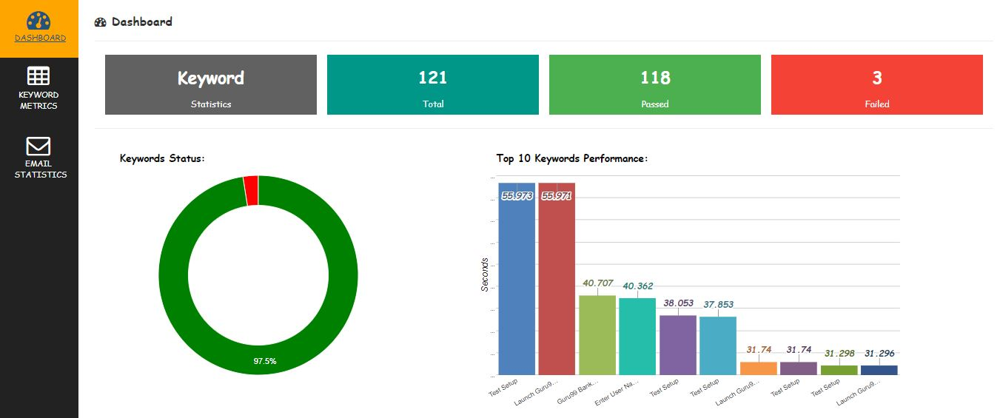
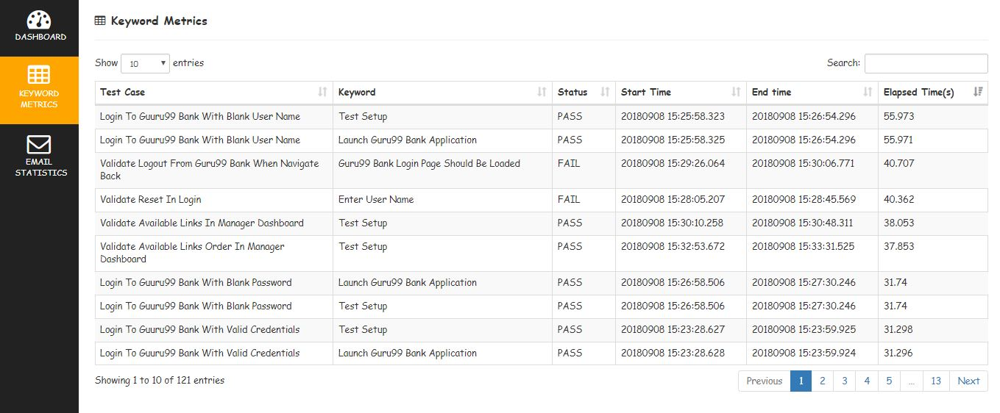
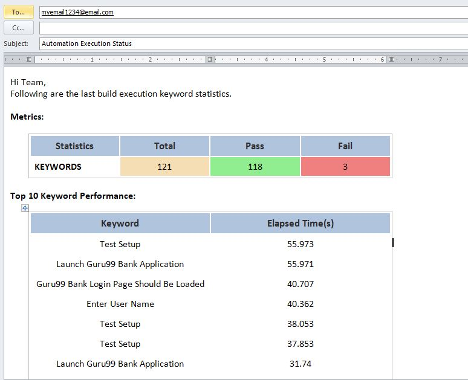

# Robot Framework Keyword Metrics Report

Creates HTML Keyword metrics report based on robotframework output.xml

---

*How it Works:*

1. Read output.xml file using robotframework API (robot.result.model)

2. Get Keyword Name, Status, Start Time, End Time and Elapsed time values using api

3. Convert data to html report using Beautifulsoup

---

*How to use in project:*

1. Clone project or download here [link](https://github.com/adiralashiva8/RFKeywordPerformanceMetrics/releases/download/v2.1/RFKeywordPerformanceMetrics-master.zip)

    ```
    git clone https://github.com/adiralashiva8/RFKeywordPerformanceMetrics.git
    ```
2. Copy __keyword_metrics_report_creator.py__ to project

3. Install beautifulsoup: (to create html report - one time activity)

    ```
    pip install beautifulsoup4
    ```

4. Execute __keyword_metrics_report_creator.py__ file

    ```
    python keyword_metrics_report_creator.py
    ```

5. __keyword_metrics_result.html__ file will be created in current folder

---

 *Sample Report:*

 __DASHBOARD__



__KEYWORD METRICS__

 

__EMAIL STATISTICS__

 

---

*How to Ignore Library Keywords in Keyword Metrics Report*

 - In __keyword_metrics_report_creator.py__ file add specific library keywords to tuple __ignore_library__ to ignore in report

 - In Metric report, keywords with type value 'for' and 'foritem' are ignored

 - Following library keywords are ignored in Metrics Report
    ```
    ignore_library = [
     'BuiltIn',
     'SeleniumLibrary',
     'String',
     'Collections',
     'DateTime',
    ] 
    ```

---

*Credits:*

1. Robotframework [link](http://robotframework.org)
2. W3Schools [link](http://www.w3schools.com)
3. Stackoverflow [link](http://stackoverflow.com)
4. Google charts [link](https://developers.google.com/chart/)
5. DataTable [link](https://datatables.net)
6. BeautifulSoup [link](http://beautiful-soup-4.readthedocs.io)
7. Jquery | JavaScript [link](https://www.jqueryscript.net)
8. Bootstrap [link](https://getbootstrap.com/)
9. Icons8 [link](https://icons8.com/)
10. FontAwesome [link](https://fontawesome.com)

---

> You are watching first HTML 'Keyword Metrics Report' in Robot framework.

---
